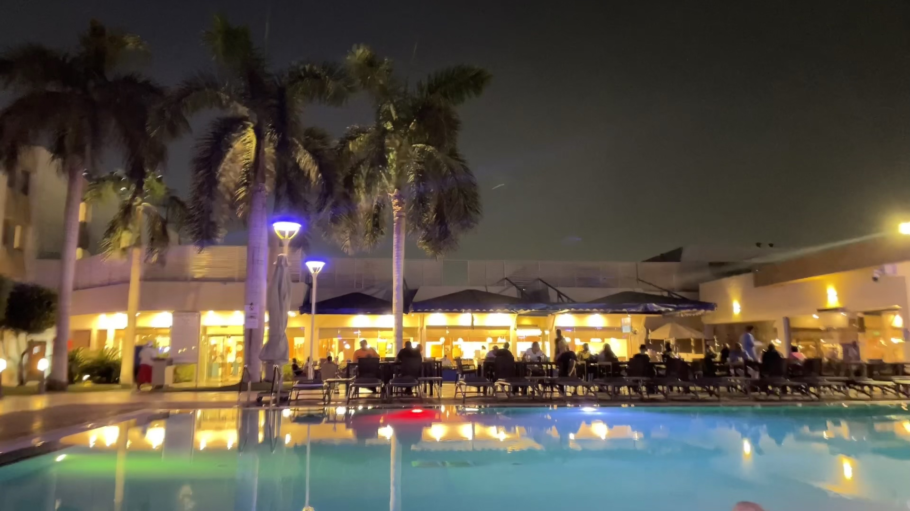

Hi, guys. I am a Ph.D student in US, the following are my research aim:

- Bioinformatics algorithm and toolkit development
- Metagenomics/Assembly/Protein structure predict

What else do you need? Contact me at [Github](http://jinhuili-lab.github.io/) or [Email](http://jinhuili-lab.github.io/).

### My story

To be honest, you can visit my [resume](https://jinhuili-lab.github.io/resume/) to know me.
I got my bachelar degree and master degree in China. After working for sequencer R&D center of BGI group for one year, I found that this hinders my growth. So I seeked for a PhD position, and finally joined the Zhang Lab. in SLU.

