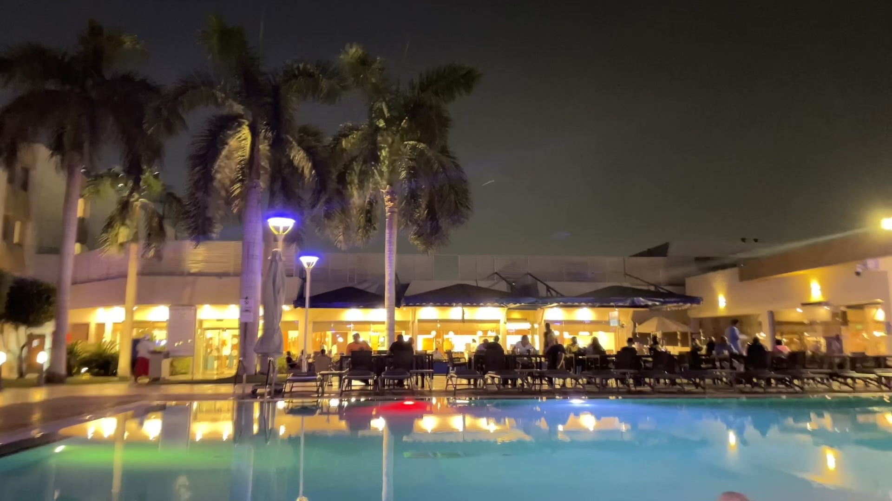
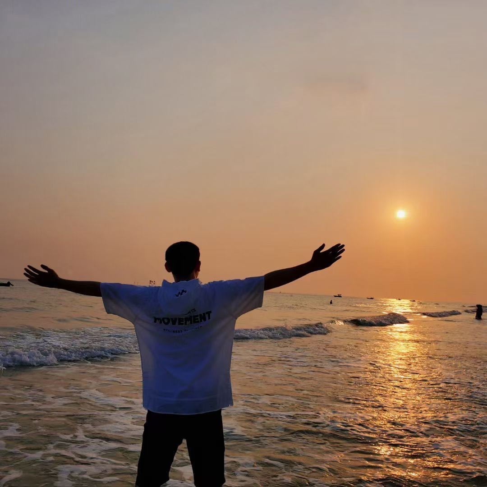

Hi, now I am a Ph.D student. I like hiking in weekends. If stay at home, I will enjoy coding.

### My story

You can visit my [resume](https://jinhuili-lab.github.io/resume/index_en.html) to know me.
I got my bachelar degree in [Henan Normal University](https://www.htu.edu.cn/)(China) and master degree in [Guangxi University](https://www.gxu.edu.cn/)(China). After working at sequencer R&D center of [BGI group](https://www.genomics.cn/) for one year, I joined the Dr Zhang Lab in Saint Louis University.

My blog can be available at [here]( https://jinhuili-lab.github.io/blog/)

### My research aim:

- Bioinformatics algorithm and toolkit development
- Metagenomics/Assembly/Protein structure predict
- Genomics repeats

Interested for something about above aim? Contact me at [Github](https://github.com/jinhuili-lab) or [Email](jinhui.li@slu.edu).
 
### Enjoy Life
- Here are some my favorite pictures. 

### My Photo

More detail of my life, you can visit my blog.
### Else
Life is short, be happy.